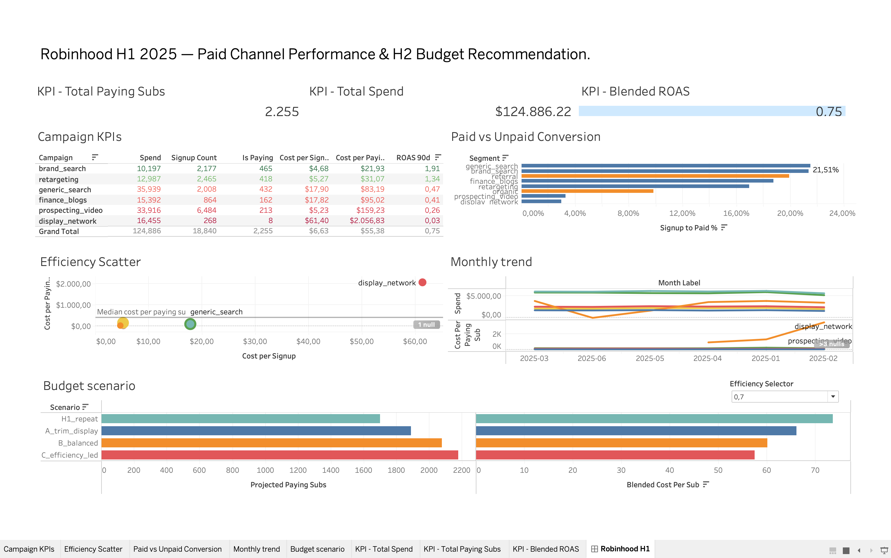

# Paid Channel Performance & H2 2025 Budget Recommendation
**Robinhood growth team · Jan–Jun 2025 · SQL Server + Tableau**

> **Riepilogo (IT):** Analisi della spesa pubblicitaria e delle conversioni di Robinhood nel primo semestre 2025, per capire quali canali meritano più budget nel secondo semestre. La raccomandazione principale: azzerare `display_network` (fermo da metà maggio, quasi nessun ritorno), mantenere un budget di test su `prospecting_video` invece di tagliarlo del tutto, e spostare risorse verso `generic_search` e `retargeting`, i canali con il miglior ritorno per abbonato pagante.

## 1. Recommendation (read this first)

| Campaign | H1 spend | H1 ROAS (90d) | Cost / paying sub | Suggested action |
|---|---|---|---|---|
| brand_search | $10,197 | 1.91 | $21.93 | Scale cautiously — best return, but likely capped by existing brand demand |
| retargeting | $12,987 | 1.34 | $31.07 | Scale — strong return, cheapest reliable channel after brand |
| generic_search | $35,939 | 0.47 | $83.19 | Optimise — highest signup-to-paid rate (22%), worth bid/creative testing before cutting |
| finance_blogs | $15,392 | 0.41 | $95.02 | Hold — steady mid-tier performer |
| prospecting_video | $33,916 | 0.26 | $159.23 | Cut to a small test budget, don't zero out — feeds the retargeting audience |
| display_network | $16,455 | 0.03 | $2,056.83 | Cut to $0 — stopped itself on 14 May, 8 paying subs total |

**Live dashboard:** `dashboard/robinhood_dashboard.pdf` (interactive `.twbx` also included — open with the free [Tableau Reader](https://www.tableau.com/products/reader)).



## 2. Business question
The CMO is setting the H2 2025 budget. Which paid channels are actually worth the money, and how should the next six months of spend be split?

## 3. Key findings

**1. Cheapest per signup is not cheapest per paying subscriber.**
`prospecting_video` ($5.23/signup) and `retargeting` ($5.27/signup) cost almost the same to acquire a signup — but `prospecting_video` costs **$159.23 per paying subscriber, about 5.1× more** than retargeting's $31.07. Judging channels by signup volume alone would rank them as near-equal; judging by paying customers separates them completely.

**2. Only two of six campaigns paid back their cost within 90 days (ROAS ≥ 1.0):** `brand_search` (1.91) and `retargeting` (1.34). The other four range from 0.03 to 0.47 — meaning on 90-day revenue alone, they hadn't yet earned back what was spent. This is not necessarily "cut everything below 1.0": 90-day revenue understates lifetime value, especially for annual-plan subscribers.

**3. Unpaid signups convert differently than paid.** Referral converts at ~19.9%, organic at ~9.8%, and all paid campaigns pooled at ~11.9%. Notably, `prospecting_video` (3.3%) converts *worse than organic traffic*, despite being a paid channel.

**4. `display_network` stopped running mid-way through the period.** Last spend was 14 May 2025 — 47 days with no spend by the end of the data window. It should not be treated as an ongoing channel in the budget conversation.

**5. Cost-per-paying-subscriber for `display_network` grew increasingly noisy toward its final weeks**, driven by very small subscriber counts in the denominator — a data-volume caveat, not a real trend.

## 4. Data and method

- **Sources:** `ad_spend.csv` (1,046 rows, daily spend by campaign) and `signups.csv` (18,840 rows, one row per user with 90-day revenue).
- **Data-quality fixes:** channel names normalised to a shared `channel_key` (`Paid Search` → `paid_search`); 7 exact duplicate spend rows removed ($920.24 of double-counted spend); all logic checks (clicks ≤ impressions, no negative spend, no subscription before signup, plan/revenue consistency) passed with 0 violations.
- **Nulls in `signups.csv` are structural, not missing data:** `campaign` is empty for organic/referral users (4,574 rows); `plan` and `subscription_start_date` are empty for the 16,585 users who never subscribed. Verified consistent and kept as NULL — not dropped, not imputed.
- **Model:** star schema — `dim_campaign`, `dim_date`, `fact_ad_spend_daily` (PK: date+campaign), `fact_signups` (PK: user_id) — with enforced primary/foreign keys. Both fact tables are aggregated to campaign level *before* joining, avoiding the fan-out that a direct daily-spend-to-user join would cause. A reconciliation query confirms metrics-table totals exactly match source totals.

```
dim_date ──< fact_ad_spend_daily >── dim_campaign ──< fact_signups >── dim_date
```

## 5. Which metric should judge channels?

**Cost per paying subscriber and 90-day ROAS**, not cost per signup. Cost per signup rewards raw volume regardless of whether that traffic ever pays — exactly the trap `prospecting_video` falls into. Ranking campaigns by cost-per-signup vs. cost-per-paying-sub produces different orderings (see `sql/` Section 7, `vw_metric_rankings`); the metric you choose changes who looks like a winner.

## 6. Budget model and assumptions

- Same total H2 budget as H1 ($124,886.22 total, multiplier = 1.0).
- Spend up to a campaign's H1 level converts at its H1 cost-per-paying-sub rate; additional spend above that converts at only 50% / 70% / 100% of that rate (tested as a sensitivity range), reflecting diminishing returns on scaling.
- Revenue per paying subscriber held at each campaign's H1 average.
- At the 0.7 (middle) efficiency assumption: repeating H1's exact split projects **1,698 paying subscribers at $73.55/sub**; a rebalanced split (cutting display to zero, capping prospecting, shifting to generic_search/retargeting) projects up to **~2,174 subscribers at ~$57.43/sub**.

## 7. Risks and limitations

- **90-day revenue is not lifetime value or profit.** No margin, churn, or renewal data is available — even the best-performing scenario projects a blended ROAS below 1.0.
- **Brand search and retargeting mostly capture existing demand** and may not absorb significantly more spend without hitting diminishing returns faster than modeled. Incrementality (would these signups have happened anyway?) is untested.
- **Cutting `prospecting_video` too far may shrink `retargeting`'s audience pool** — the two channels likely interact, and the model treats every campaign as independent.
- **Attribution is last-touch by channel/campaign**, not a full multi-touch path — the data doesn't show what led a user to convert.
- **Small samples in places:** `display_network` has only 8 paying subscribers total, so its monthly figures are volatile.
- **Suggested validation before committing the full recommendation:** a geo or holdout test on `brand_search` to check incrementality, and a small controlled test on `prospecting_video` with new creative/audience targeting rather than a straight budget cut.

## 8. Repo structure

```
├── README.md
├── data/                 raw CSVs (unchanged) + column dictionary
├── sql/                  full build script + section-by-section README
├── outputs/              exported metric tables (CSV) + chart images
└── dashboard/            Tableau .twbx, PDF export, and PNG screenshot
```

## 9. How to reproduce

1. Import `data/ad_spend.csv` and `data/signups.csv` as `dbo.raw_ad_spend` and `dbo.raw_signups` in SQL Server (no primary key on `raw_ad_spend`; primary key on `user_id` only for `raw_signups`).
2. Run `sql/robinhood_marketing_analysis_tsql.sql` (Sections 1–2), then `sql/robinhood_part2_remaining_build.sql`, section by section — see `sql/README.md` for checkpoints.
3. Export the analysis views listed at the end of the build script into `outputs/`.
4. Open `dashboard/robinhood_dashboard.twbx` in [Tableau Reader](https://www.tableau.com/products/reader) (free) for the interactive version, or view `dashboard/robinhood_dashboard.pdf` / the PNG above for a static snapshot.
